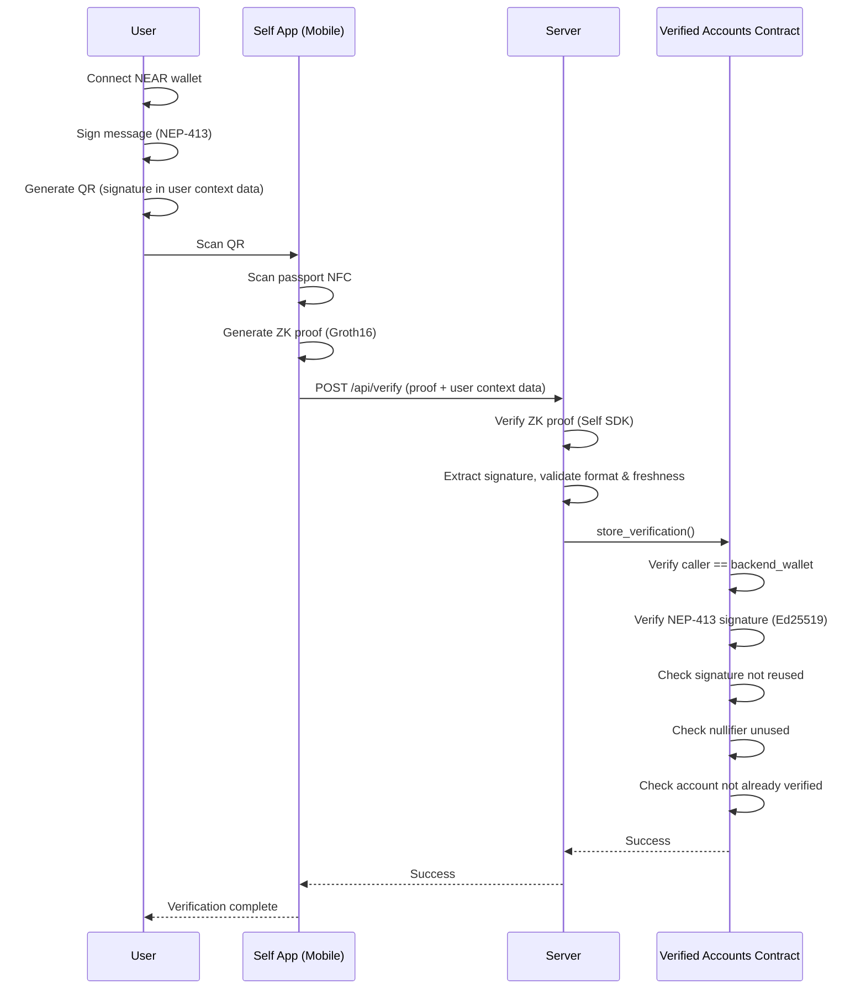

# Identity Verification & DAO Governance

## How Identity Verification Works

The user connects their NEAR wallet and signs a message using the NEP-413 standard, which proves they control the wallet. This signature is embedded in Self.xyz QR code as "user context data"—an arbitrary JSON object that Self.xyz carries throughout the verification process.

The user scans this QR with the Self.xyz mobile app, which reads their passport's NFC chip and generates a Groth16 zero-knowledge proof. This proof confirms the passport is valid—without revealing any personal information. After the proof is generated, the Self app calls the `/api/verify` endpoint with the proof and user context data.

The web app backend receives the proof and validates it using the Self SDK. It then extracts the NEAR signature from the user context data and validates the format and timestamp freshness (signatures must be <10 minutes old). The backend does not cryptographically verify the signature—that happens on-chain.

The backend calls `store_verification()` using `backend_wallet` on the contract. The contract verifies that the caller is the authorized `backend_wallet`, then performs on-chain NEP-413 signature verification using Ed25519. It also checks that the nullifier (a unique hash derived from the passport) hasn't been used before, and that the account isn't already verified. This ensures one passport can only verify one NEAR account.

### What Gets Stored Onchain

The contract stores the nullifier, NEAR account ID, attestation type, timestamp, and the full ZK proof for potential future re-verification. No personally identifiable information is ever stored.

---

## Trust Model

The system has one trusted actor: the **`backend_wallet`**. This is the NEAR account that runs the verification server.

The `backend_wallet` is the only account that can write to the Verified Accounts contract (via `store_verification()`).

However, its power is limited. The contract re-verifies all signatures on-chain, so `backend_wallet` cannot forge wallet ownership. Nullifier uniqueness is enforced on-chain, so it cannot register duplicate passports. If compromised, the wallet can be rotated via `update_backend_wallet()`, but that needs to happen before any malicious action is taken.
