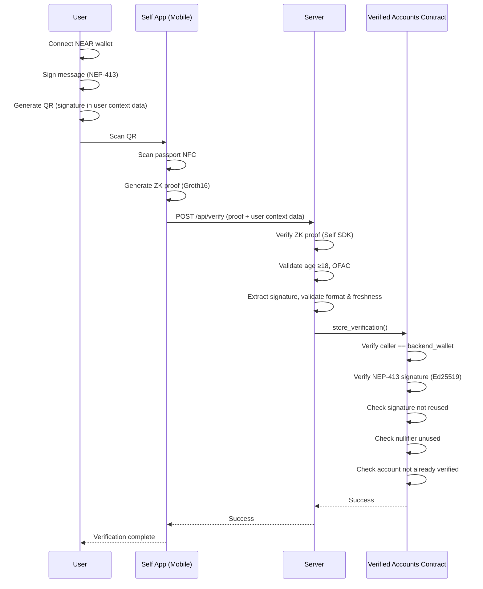
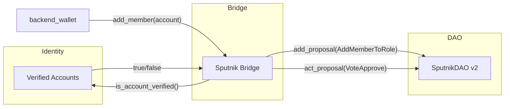
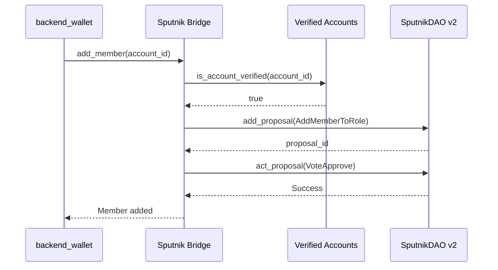
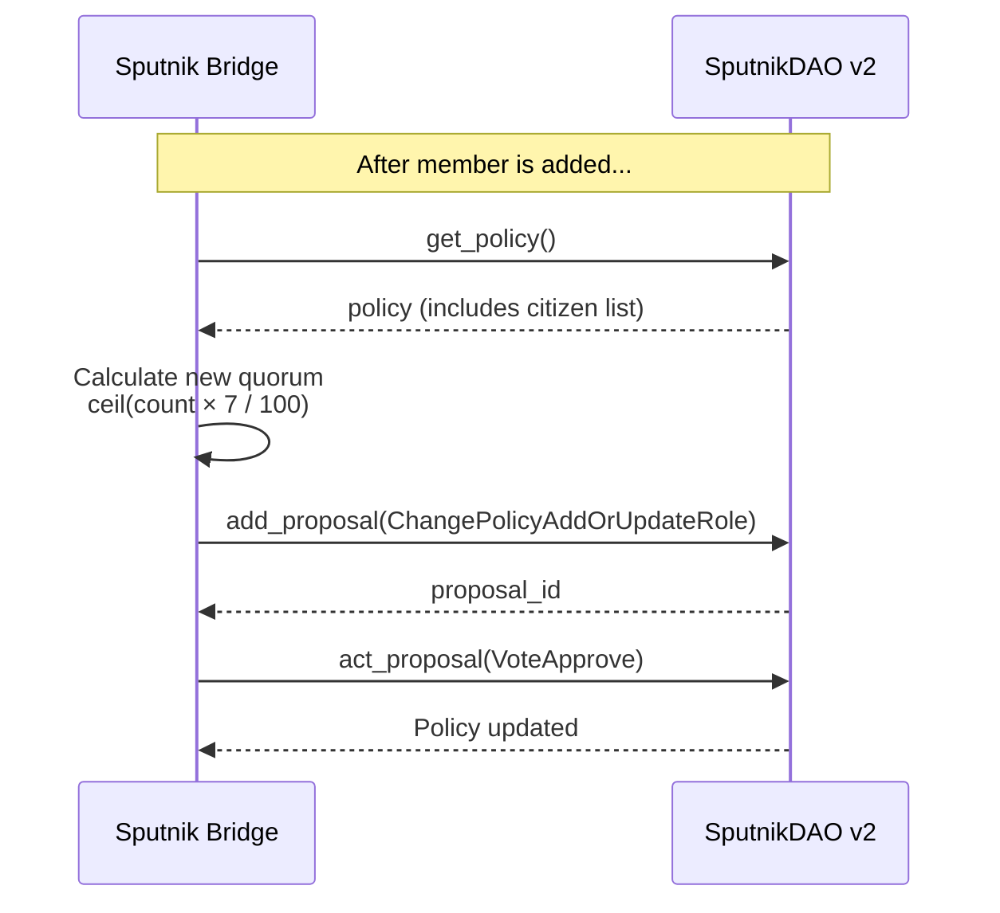

# Identity Verification & DAO Governance

## How Identity Verification Works

The user connects their NEAR wallet and signs a message using the NEP-413 standard, which proves they control the wallet. This signature is embedded in Self.xyz QR code as "user context data"—an arbitrary JSON object that Self.xyz carries throughout the verification process.

The user scans this QR with the Self.xyz mobile app, which reads their passport's NFC chip and generates a Groth16 zero-knowledge proof. This proof confirms the passport is valid, the person is 18+, and they're not on sanctions lists—without revealing any personal information. After the proof is generated, the Self app calls the `/api/verify` endpoint with the proof and user context data.

The web app backend receives the proof and validates it using the Self SDK (checking proof validity, age requirement, and optionally OFAC sanctions). It then extracts the NEAR signature from the user context data and validates the format and timestamp freshness (signatures must be <10 minutes old). The backend does not cryptographically verify the signature—that happens on-chain.

The backend calls `store_verification()` using `backend_wallet` on the contract. The contract verifies that the caller is the authorized `backend_wallet`, then performs on-chain NEP-413 signature verification using Ed25519. It also checks that the nullifier (a unique hash derived from the passport) hasn't been used before, and that the account isn't already verified. This ensures one passport can only verify one NEAR account.

### What Gets Stored Onchain

The contract stores the nullifier, NEAR account ID, attestation type, timestamp, and the full ZK proof for potential future re-verification. No personally identifiable information is ever stored.



---

## How Governance Works (SputnikDAO Integration)

### SputnikDAO Basics

SputnikDAO is a DAO framework on NEAR that uses **roles** and **permissions** to control who can do what.

**Roles** are groups of accounts. Each role has a set of permissions that define what proposal types its members can create and how they can vote. For example, a "council" role might be able to create transfer proposals, while a "community" role can only vote on them.

**Permissions** follow the format `proposal_type:action`. For instance, `vote:VoteApprove` means "can vote to approve Vote proposals", while `transfer:AddProposal` means "can create Transfer proposals".

**Proposals** are actions that require approval before execution. Common types include `Vote` (text-only governance discussions), `AddMemberToRole` (add someone to a role), `Transfer` (send funds), and `FunctionCall` (execute a contract method).

**Voting** uses configurable policies. Weight can be role-based (1 member = 1 vote) or token-based. A threshold (e.g., 50% majority) determines when proposals pass.

### Our Sputnik Configuration

For Citizens House, we configure SputnikDAO with two main roles:

- **citizen** — Verified users. Can vote on proposals but cannot create them. Permissions: `vote:VoteApprove`, `vote:VoteReject`.
- **bridge** — The Sputnik Bridge contract. Can add new citizens, create Vote proposals, and update the citizen role's voting policy (for dynamic quorum). Permissions: `add_member_to_role:AddProposal`, `add_member_to_role:VoteApprove`, `policy_add_or_update_role:AddProposal`, `policy_add_or_update_role:VoteApprove`, `vote:AddProposal`.

The voting policy uses role-weighted voting (1 citizen = 1 vote), dynamic quorum (7% of citizens), and a 50% threshold to pass. Voting period is 7 days. All are configurable on deployment.

### The Three Contracts

The system uses three contracts working together:



**Verified Accounts** is the identity oracle. It stores which accounts have been verified and exposes `is_account_verified()` for other contracts to query.

**Sputnik Bridge** is the gatekeeper that enforces verification. The `backend_wallet` has no role in SputnikDAO—only the bridge contract holds the `bridge` role with permission to add members. When `backend_wallet` calls `add_member()`, the bridge makes a cross-contract call to Verified Accounts to check if the account is verified. If not, the bridge rejects the request with "Account is not verified - cannot add to DAO". This check is enforced by the bridge's code, not by `backend_wallet`—meaning even if `backend_wallet` wanted to add an unverified account, the bridge would refuse. Only after verification passes does the bridge create and auto-approve a proposal on SputnikDAO to add the member (this is the only way to add a member to the DAO, through an AddMemberToRole proposal). The same pattern applies to creating Vote proposals: `backend_wallet` can only trigger creating a proposal through the bridge, and the bridge has the permission.

**SputnikDAO v2** is a standard, unmodified Sputnik contract that handles proposals and voting. The bridge integrates with it through the existing proposal system.

### Adding a Citizen to the DAO



### Voting Requirements

SputnikDAO uses two parameters to determine when a proposal passes: **quorum** and **threshold**.

- **Quorum** is the minimum number of votes required for a proposal to be valid.
- **Threshold** is the number of "yes" votes needed to approve a proposal.

**SputnikDAO v2 Limitation:** Threshold is calculated as a percentage of **total citizens**, not votes cast. This means with 100 citizens you need 51 YES votes to pass, regardless of how many people vote.

SputnikDAO calculates an **effective threshold** as:

```
effective_threshold = max(quorum, threshold_weight)
```

Where `threshold_weight` for a 50% (1/2) ratio is:

```
threshold_weight = (citizen_count / 2) + 1
```

**Our Configuration**

The Sputnik Bridge automatically updates the quorum after every member addition:

```
quorum = ceil(citizen_count × 7 / 100)
```

| Citizens | Quorum (7%) | Threshold (50%) | Votes Needed to Pass |
| -------- | ----------- | --------------- | -------------------- |
| 1        | 1           | 1               | 1                    |
| 10       | 1           | 6               | 6                    |
| 15       | 2           | 8               | 8                    |
| 50       | 4           | 26              | 26                   |
| 100      | 7           | 51              | 51                   |
| 1000     | 70          | 501             | 501                  |

The 50% threshold dominates in practice—you need majority support from total citizens. The 7% quorum provides a floor for edge cases with very few citizens.

**How the Update Works**

After each successful `add_member()` call, the bridge:

1. Queries SputnikDAO's policy to get the current citizen count
2. Calculates the new quorum: `ceil(citizen_count × 7 / 100)`
3. Creates a `ChangePolicyAddOrUpdateRole` proposal with the updated quorum
4. Auto-approves the proposal (bridge has permission to update the citizen role's policy)

This happens automatically in a chain of cross-contract calls, so the quorum is always in sync with membership.



### Voting

Once added as a citizen, users vote directly on SputnikDAO. Citizens can only vote on proposals—they cannot create them. The bridge creates proposals on behalf of the `backend_wallet`.

---

## Trust Model

The system has one trusted actor: the **`backend_wallet`**. This is the NEAR account that runs the verification server.

The `backend_wallet` is the only account that can write to the Verified Accounts contract (via `store_verification()`) and the only account that can trigger the Sputnik Bridge to add members (via `add_member()`) or create text proposals (via `create_proposal()`).

However, its power is limited. The contracts re-verify all signatures on-chain, so `backend_wallet` cannot forge wallet ownership. Nullifier uniqueness is enforced on-chain, so it cannot register duplicate passports. It has no ability to move funds or vote on governance proposals. The bridge can only update the citizen role's voting policy (for dynamic quorum)—it cannot change other aspects of the DAO policy.

For best security, the Verified Accounts backend wallet and the Sputnik Bridge backend wallet should be different accounts—this limits the blast radius if one is compromised. If compromised, the wallet can be rotated via `update_backend_wallet()`, but that needs to happen before any malicious action is taken.
