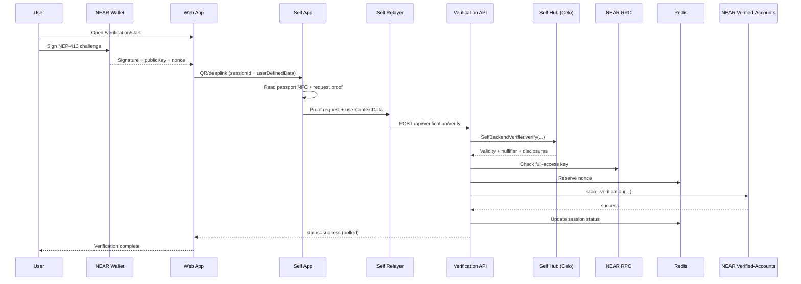

# How It Works

## Overview

NEAR Citizens House links a NEAR wallet to a single real-world identity using Self.xyz zero-knowledge proofs. The Next.js web app coordinates wallet signing and QR/deeplink issuance, the Self mobile app scans the document and triggers proof generation via Self’s TEE/relayer flow, and the backend writes the verified result to the NEAR verified-accounts contract. A Citizens view can re-verify stored proofs for transparency.

## Core components

- **Web app (Next.js)**: `/verification` flow, wallet connect, QR/deeplink, and `/citizens` table.
- **Verification API**: `POST /api/verification/verify` validates proofs and writes on-chain; `GET /api/verification/status` reports session state for polling and mobile callbacks.
- **Self.xyz**: QR/deeplink SDK and Self app; Self relayers deliver proofs to the backend, which uses `SelfBackendVerifier` to validate them against the Self hub.
- **NEAR verified-accounts contract**: stores verifications, verifies NEP-413 signatures on-chain, enforces uniqueness.
- **Redis**: short-lived session status and nonce replay protection.
- **Celo verifier**: optional re-verification of stored proofs via Self’s IdentityVerificationHub contract.

## End-to-end verification flow

1. **Wallet signature**: the user connects a NEAR wallet and signs a NEP-413 challenge (message + 32-byte nonce + recipient). The message is derived from the app URL and contract ID so it can be rebuilt deterministically later; uniqueness comes from the random nonce.
2. **QR/deeplink creation**: the app builds a Self payload (`SelfAppBuilder`) containing:
   - `userId` (UUID session ID)
   - `userDefinedData` with NEP-413 fields (accountId, publicKey, signature, nonce, timestamp). Self docs describe `userDefinedData` as an app-supplied string passed through verification (often used to select configs/disclosures) and encoded to bytes in the QR flow. The challenge and recipient are omitted to keep the QR payload small; the backend reconstructs them from config and accountId.
3. **Self app proof**: the Self mobile app reads the passport NFC and initiates proof generation; Self’s TEE/relayer flow produces the Groth16 proof. Self relayers submit the proof to `POST /api/verification/verify` with `attestationId`, proof, public signals, and `userContextData`.
4. **Backend verification**:
   - verifies the ZK proof via `SelfBackendVerifier` (which validates against the Self hub and config)
   - extracts the nullifier from `discloseOutput` and signature payload from `userData.userDefinedData`
   - rebuilds the NEP-413 challenge/recipient, checks signature freshness (10 min), and enforces nonce replay via Redis
   - confirms the public key is a full-access key via NEAR RPC
   - updates the Redis session for client polling
5. **On-chain write**: the backend calls `store_verification` using a key pool derived from `NEAR_PRIVATE_KEY` (10 rotating access keys to support concurrency).
6. **Contract checks**: the contract ensures the backend wallet is the caller, verifies the NEP-413 signature with `ed25519_verify`, enforces unique nullifier + account, and stores the verification.
7. **Client completion**: the UI polls `GET /api/verification/status`; mobile users return via `/verification/callback`, which polls until the session is marked `success` or `error`.

## Verification sequence

## Citizens audit & re-verification

The `/citizens` page lists verifications directly from the contract. For each record, the server action re-verifies:

- **ZK proof** via Self’s IdentityVerificationHub on Celo (`verifyStoredProofWithDetails`)
- **NEP-413 signature** by rebuilding the signed payload from `user_context_data`.

## On-chain data

The contract stores:

- `nullifier` (unique identity hash)
- `near_account_id`
- `attestation_id` (passport/ID type)
- `verified_at` timestamp
- `self_proof` (Groth16 proof + public signals)
- `user_context_data` (signature payload used for audit)

## Backend wallet authority

The verified-accounts contract is admin-gated: only the backend wallet can write records or change operational state. It is the sole caller allowed to:

- `store_verification` (write a new verification)
- `pause` / `unpause` (freeze or resume writes)
- `update_backend_wallet` (rotate the admin account)

This matters because the contract does **not** verify Self proofs itself. Proofs are validated off-chain by the backend, so end users are never trusted to write directly. The backend wallet submits writes only after the proof and NEP-413 signature checks pass, and the contract enforces the caller check on-chain.

## Why backend verification (vs on-chain)

Self supports an on-chain flow where an EVM contract inherits `SelfVerificationRoot` and calls the IdentityVerificationHub on Celo. The hub verifies the proof and calls back the contract with disclosed fields. That flow is great for EVM apps, but it assumes Celo execution and a relayer submitting proofs on-chain.

NEAR contracts cannot call the Celo hub directly, so implementing the on-chain flow would require a Celo contract plus cross-chain messaging (bridge/relayer) back to NEAR, or forcing users to manage a Celo wallet. Using `SelfBackendVerifier` keeps the proof check anchored to the same hub/config while letting the backend write the verified result to the NEAR contract, so users only need a NEAR wallet and the Self app.

## Trust model & networks

- **Backend wallet** is the only writer; the contract enforces signature validity and uniqueness.
- **Backend verification** checks full-access keys and proof validity; the contract does not verify proofs itself.
