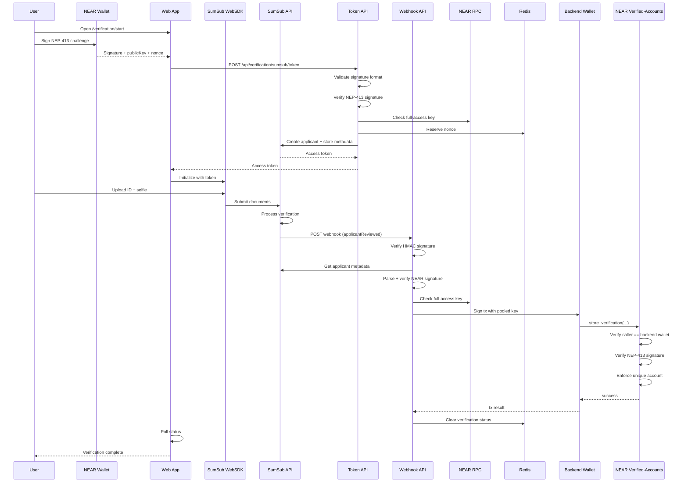

# NEAR Citizens House Verification - Technical Architecture

## Overview

NEAR Citizens House links a NEAR wallet to a verified real-world identity using SumSub verification. The Next.js web app coordinates wallet signing and WebSDK initialization, SumSub's WebSDK handles document capture and liveness verification, and the backend writes the verified result to the NEAR verified-accounts contract after receiving webhook confirmation. A Citizens view displays stored verifications for transparency.

## Core components

- **Web app (Next.js)**: `/verification` flow, wallet connect, SumSub WebSDK integration, and `/citizens` table.
- **Verification API**:
  - `POST /api/verification/sumsub/token` validates NEAR signatures and generates SumSub access tokens
  - `POST /api/verification/sumsub/webhook` receives verification results from SumSub and stores on-chain
  - `GET /api/verification/status` reports verification state for client polling
- **SumSub**: WebSDK for document capture and liveness verification; webhook delivery for verification results.
- **NEAR verified-accounts contract**: stores verifications, verifies NEP-413 signatures on-chain, enforces account uniqueness.
- **Redis**: short-lived verification status cache and nonce replay protection.

## End-to-end verification flow

1. **Wallet signature**: the user connects a NEAR wallet and signs a NEP-413 challenge (message + 32-byte nonce + recipient). The message is derived from the app URL and contract ID so it can be rebuilt deterministically later; uniqueness comes from the random nonce.

2. **Token generation**: the frontend sends the signature to `POST /api/verification/sumsub/token`, which:
   - Validates signature data format (timestamp freshness, nonce format, public key format)
   - Verifies the NEP-413 signature cryptographically
   - Confirms the public key is a full-access key via NEAR RPC
   - Reserves the nonce in Redis (10 min TTL) to prevent replay attacks
   - Creates or retrieves the SumSub applicant using the NEAR account ID as `externalUserId`
   - Stores NEAR signature metadata on the applicant (account_id, signature, public_key, nonce, timestamp)
   - Returns a SumSub access token for WebSDK initialization

3. **Identity verification**: the user completes verification in the SumSub WebSDK:
   - Takes a photo of their government-issued ID (passport, driver's license, national ID, or residence permit)
   - Completes a liveness selfie check
   - SumSub processes the documents and performs identity verification

4. **Webhook delivery**: when verification completes, SumSub sends an `applicantReviewed` webhook to `POST /api/verification/sumsub/webhook` containing the review result:
   - **GREEN**: approved - proceed with on-chain storage
   - **YELLOW**: needs manual review - set status to `VERIFICATION_ON_HOLD`
   - **RED**: rejected - set status to `VERIFICATION_REJECTED` or `VERIFICATION_RETRY` based on `reviewRejectType`

5. **Backend verification** (for GREEN results):
   - Verifies the webhook HMAC signature
   - Retrieves applicant data and extracts NEAR signature metadata
   - Rebuilds and verifies the NEP-413 signature cryptographically
   - Confirms the public key is still a full-access key via NEAR RPC
   - Updates the Redis session for client polling

6. **On-chain write**: the backend, using the backend wallet, calls `store_verification` with a key pool derived from `NEAR_PRIVATE_KEY` (10 rotating access keys to support concurrency).

7. **Contract checks**: the contract ensures the backend wallet is the caller, verifies the NEP-413 signature with `ed25519_verify`, enforces unique account, and stores the verification.

8. **Client completion**: the UI polls `GET /api/verification/status` until the session is marked `approved`, `failed`, or `hold`.

## Verification sequence

## Citizens audit & re-verification

The `/citizens` page lists verifications directly from the contract. For each record, the server action re-verifies:

- **NEP-413 signature** by rebuilding the signed payload from `user_context_data` and verifying cryptographically.

This ensures the stored signature data remains valid and was not corrupted.

## On-chain data

The contract stores:

- `near_account_id`: the verified NEAR account
- `verified_at`: timestamp (nanoseconds since epoch)
- `user_context_data`: JSON containing signature payload for audit (accountId, publicKey, signature, nonce, timestamp)

## Backend wallet authority

The verified-accounts contract is admin-gated: only the backend wallet can write records or change operational state. It is the sole caller allowed to:

- `store_verification` (write a new verification)
- `pause` / `unpause` (freeze or resume writes)
- `update_backend_wallet` (rotate the admin account)

This matters because the contract does **not** verify SumSub data itself. Government-issued ID data is validated off-chain by SumSub, and the backend submits writes only after receiving a GREEN webhook and validating the NEAR signature. The contract enforces the caller check on-chain.

## Why backend verification (vs on-chain)

SumSub handles identity verification through document scanning and liveness checks. The verification result is delivered via webhooks to the backend.

This architecture provides:
- **Simplicity**: users only need a NEAR wallet - no additional apps or hardware required
- **Broad document support**: accepts passports, driver's licenses, national IDs, and residence permits from most countries
- **Privacy**: personal information is processed by SumSub and never stored on-chain; only verification status is recorded
- **Sybil resistance**: SumSub handles identity deduplication internally (same person cannot verify multiple times)

## Trust model & networks

- **Backend wallet** is the only writer; the contract enforces signature validity and account uniqueness.
- **Backend verification** checks full-access keys and validates signatures; the contract does not verify ID data itself.
- **SumSub** provides identity verification and deduplication; the system trusts SumSub's GREEN/RED/YELLOW decisions.

## Identity deduplication

SumSub handles identity deduplication internally through biometric and document matching. If the same person attempts to verify with a different NEAR account, SumSub will reject the verification. This means:

- Account uniqueness is enforced on-chain (one verification per NEAR account)
- Identity uniqueness is enforced off-chain by SumSub (one verification per real-world identity)

## Review statuses

SumSub returns one of three review answers:

| Status | Meaning | Action |
|--------|---------|--------|
| GREEN | Approved | Store verification on-chain |
| YELLOW | Needs manual review | Set status to `VERIFICATION_ON_HOLD` |
| RED | Rejected | Set status based on `reviewRejectType` |

For RED rejections, `reviewRejectType` determines whether retry is allowed:
- `RETRY`: user can attempt verification again with better documents
- `FINAL`: verification is permanently rejected

## Webhook handling

The webhook handler (`/api/verification/sumsub/webhook`) implements several important behaviors:

1. **HMAC signature verification**: validates webhook authenticity using the shared secret
2. **Idempotent processing**: handles webhook retries gracefully (SumSub retries at 5 min, 1 hr, 5 hrs, 18 hrs)
3. **Late rejection handling**: if a RED webhook arrives for an already-approved account, it's logged but doesn't revoke on-chain approval
4. **Status updates**: stores intermediate status in Redis for frontend polling

## Security considerations

1. **Signature binding**: the NEAR signature is bound to this specific verification attempt via the nonce, preventing replay attacks
2. **Full-access key verification**: ensures the signing key has full control of the account (not a limited function-call key)
3. **Nonce reservation**: prevents the same signature from being used in multiple verification attempts
4. **HMAC webhook verification**: ensures webhooks are authentic and unmodified
5. **Backend-only writes**: only the authorized backend wallet can store verifications on-chain
6. **Defense in depth**: both SumSub (identity) and the NEAR contract (signature) must validate for verification to succeed
